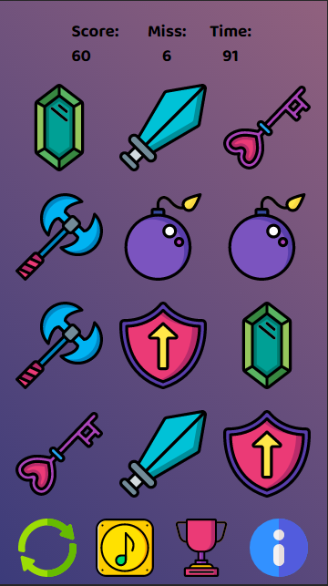

# Lysandra - Javascript Matching Game

<div style="padding-bottom:100px;text-align:center;">
<p style="text-align: center;"> 

</p>
</div>

---
## Playable Version

* Lysandra - Matching Game: [Play Now](https://johnfacey.github.io/lysandra/)
---
## Project Board


* [Project Dev Board](https://github.com/johnfacey/lysandra/projects/1?)

---

## Current Features
```
    Fix autoplay music permission
    Add Splash Screen
    Revised css and background using flex
    jQuery Libraries removed
    Matching logic fixed
    Added base scoring and misses
    Timer Added
    Leaderboard Added
    Add LocalStorage for retaining score
    manifest.json added
```
---
# Screenshots

   <div style="clear:both;text-align:center">
    
     </div>

<div style="clear:both;text-align:center">
      
     </div>

<div style="clear:both"></div>

## Credits

* Author: [johnfacey.dev](https://johnfacey.dev/)
* Twitter: [twitter.com/johnfacey](https://twitter.com/johnfacey)
* Fonts: [Google Fonts](https://fonts.google.com)
* Vectors: [Vecteezy](https://www.vecteezy.com/free-vector/game-ui)
* Icon Packs: [Flat Icons / SmashIcons](www.flaticon.com)
* Music: [Bensound](https://www.bensound.com)
